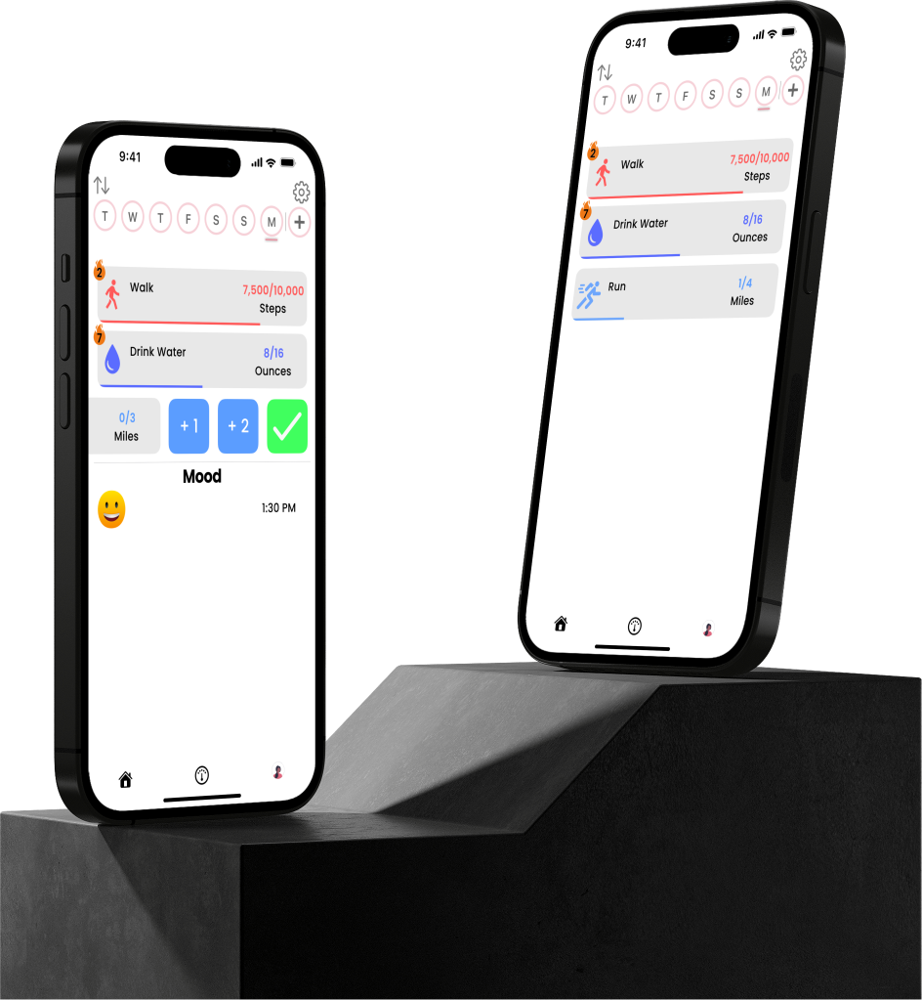
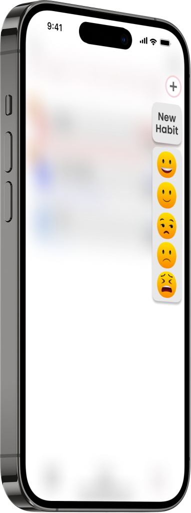
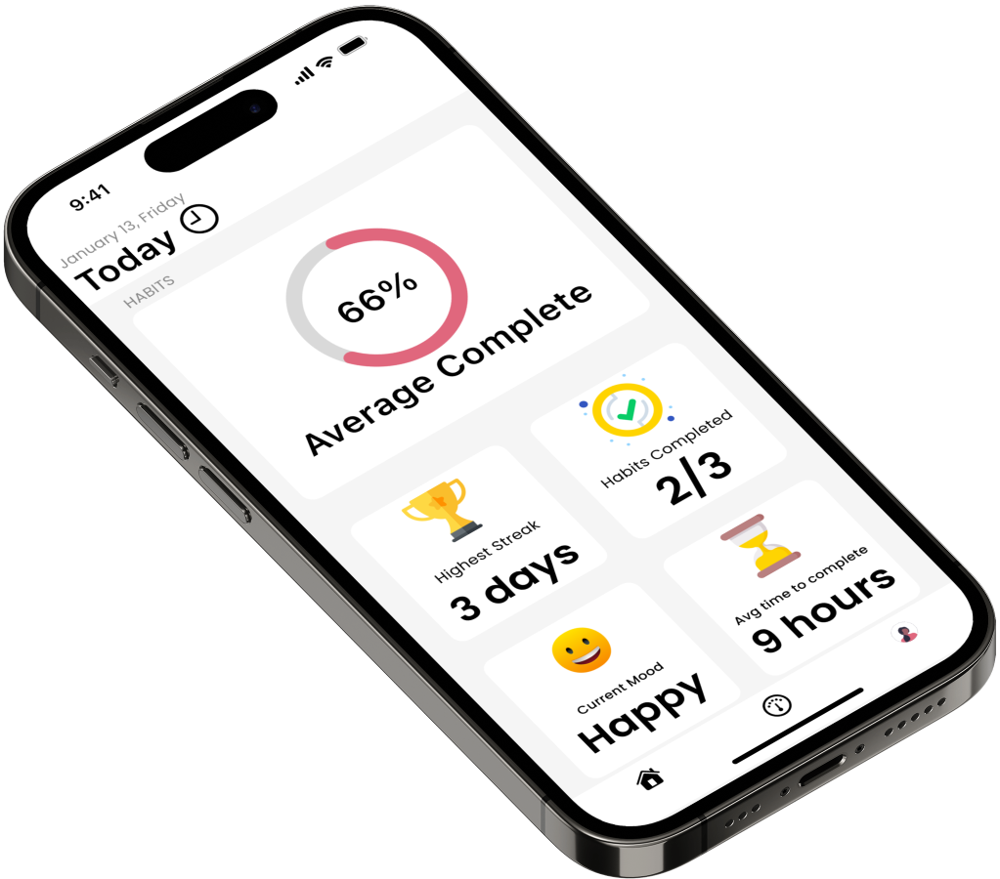
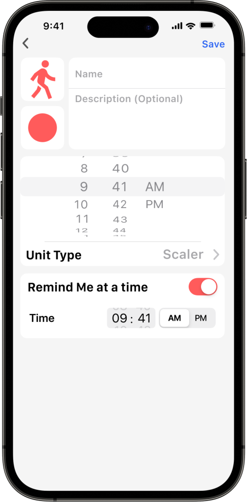

# About
Meet Habitus - a habit and mood tracking application. With a list of pre-built habits, the option for custom habits, and the ability to set your current mood, you'll be able take control of your future. Habitus will keep statistics on your habits, helping you improve your overall lifestyle and reach goals. 

You're also able to set reminders, custom goals, icons, colors, and more. It will keep track of the streaks you have on each habit, and motivate you to keep it going. 

With a personalized approach, Habits will be able to fit your needs.

## Preview
List your Habits:

Create new habits or set your current mood:

Track your habits and mood over time:

Make custom habits to suit your needs:

## Note worthy technologies/frameworks
- SwiftUI
- UIKit
- CoreData
- HealthKit integration
- Swift Charts

### Prerequisites
- An iPhone running iOS 16 or later

