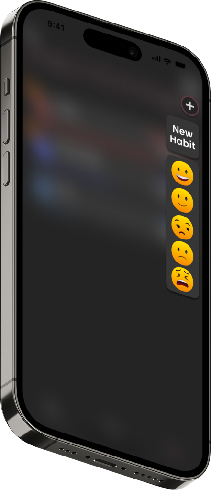

#Technical Skills

Developed using SwiftUI and UIKit frameworks
Utilizes CoreData for data storage and manipulation
Implements HealthKit integration for health data tracking
Utilizes Swift Charts for data visualization

#Requirements

An iPhone running iOS 16 or later
Screenshots

#Screenshots
List your Habits:
  

Create new habits or set your current mood:
  

Track your habits and mood over time:
  

Make custom habits to suit your needs:
  

As an iOS developer, I have extensive experience in SwiftUI, UIKit, CoreData, and HealthKit integration. My experience in utilizing these technologies is evident in the development of Habitus, a habit and mood tracking application designed to help users improve their overall lifestyle and reach their goals. I am confident that my skills and experience make me a strong candidate for any iOS development position.

